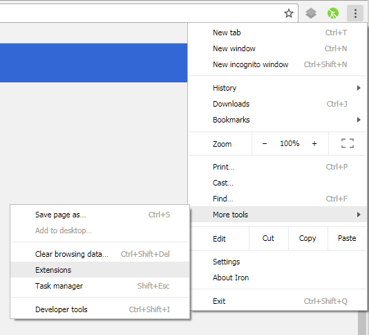
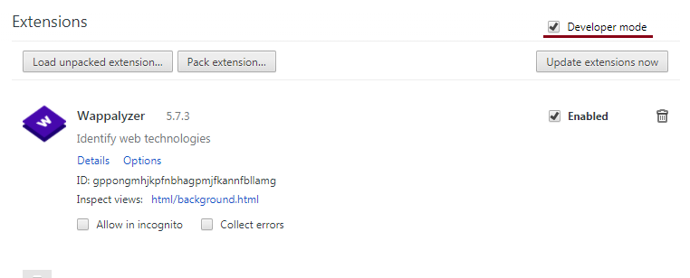
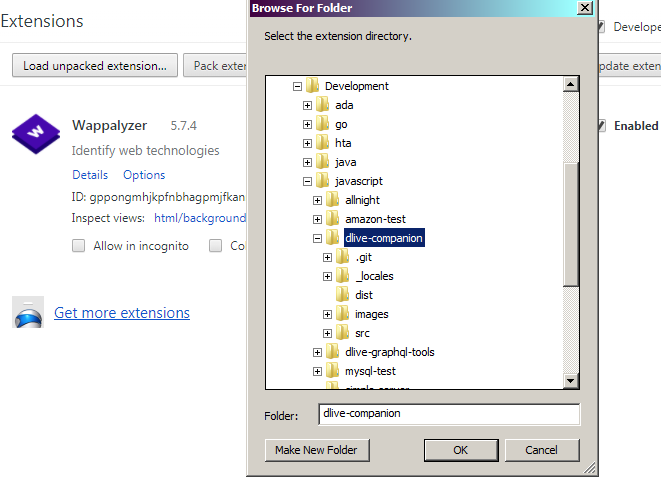

# DLive Companion

A chrome extension that shows all live streams of the people you follow. Written in mithril.js

### Building

    npm install
    npm run-script build

### Contributing

This project will use [git flow](https://www.atlassian.com/git/tutorials/comparing-workflows/gitflow-workflow)

The basic flow is to branch off develop to a new feature branch:

    git checkout develop
    git pull
    git checkout -b feature/my-cool-new-feature

implement your cool new feature, committing as you go. Then push your new branch to origin. Then simply open a pull request back into develop.

### Translating

If you want to enjoy DLive Guide in your language, just copy the folder '\_locales/en' to '\_locales/code' where code is [your locale code](https://www.w3.org/International/O-charset-lang.html). Translate the message field for each message, it will probably take you 5/10 mins. Be sure to open a pull request to help others! 

### Installation

 1. Open the extensions configuration page in Chrome

     

 2. Turn on "Developer Mode"

     

 3. "Load Unpacked Extension" and select the allnight folder

     
     
